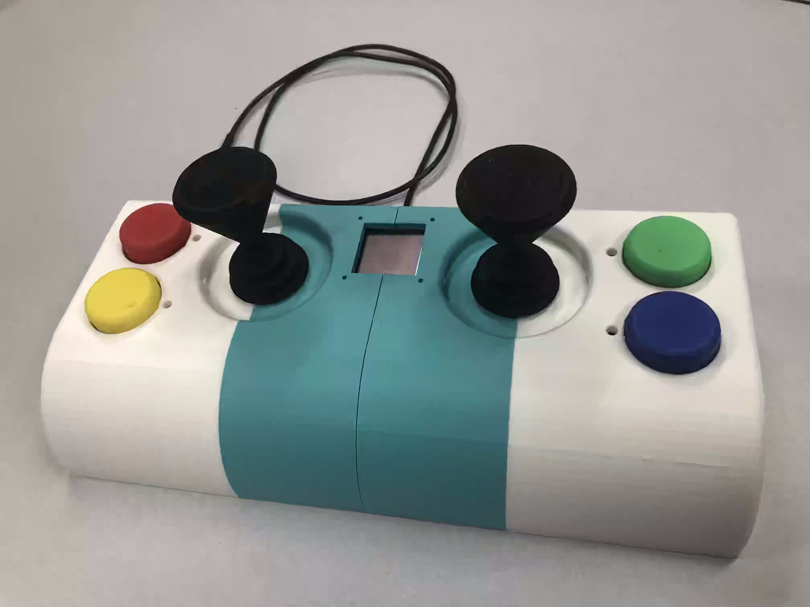
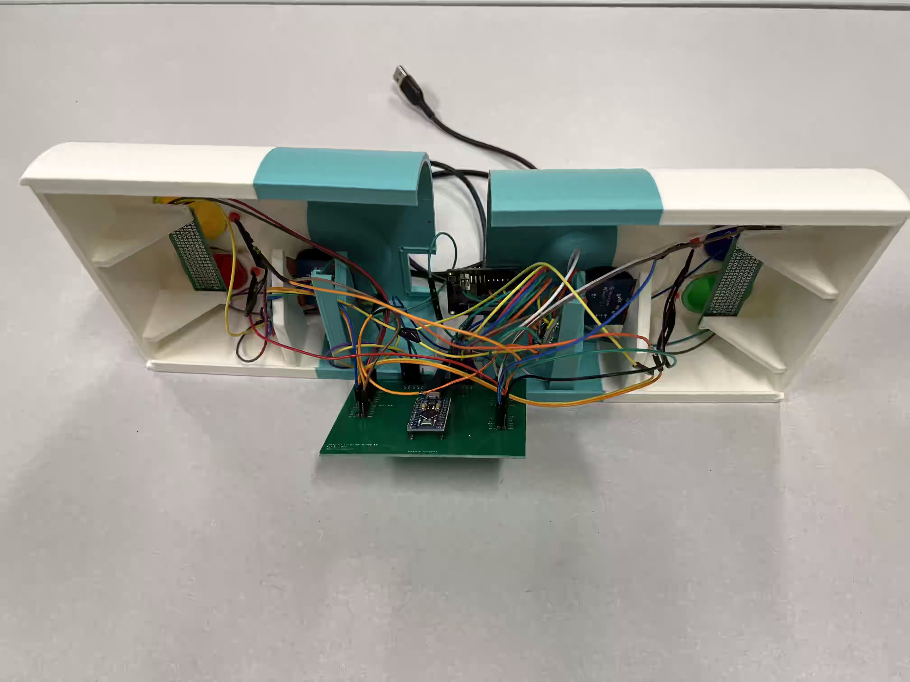
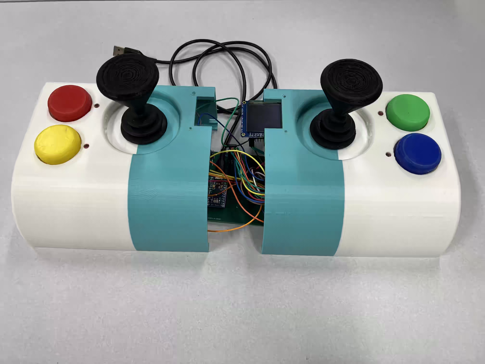

# Adaptive-Controller-Project

ECE 44x Group 18
by Anthony Nguyen, Don Nguyen, Alyssa Estenson, Jordyn Marshall

The purpose of this project is to develop a controller which can act as a keyboard and a mouse when utilized with a computer. This controller is designed to help amputees or those incapable of controlling individual fingers be able to interact with a computer efficiently. This controller falls under the category of assistive technology, hoping to increase participation among the desired user group. The team has designed and prototyped an assistive controller that utilizes joysticks and large buttons to help those who lack fingers and appendages interact with a computer, when they would otherwise be unable to interact with a standard keyboard and handheld mouse.

This controller provides keyboard and mouse functionality. This controller has been designed to be intuitive for the expected disabled user group, and can be operated accurately and precisely. The device itself has been implemented to be integrable with the target user’s daily activities, meaning it is safe and is protected to allow only limited dust and particle ingress. The controller is powered and connected to the computer via a USB cable. The risks and impacts in several fields have been considered for this project in the final design and implementation of the system.

The team has designed the system by creating a block diagram and defining the interface connections between each block. The push buttons and joysticks are both blocks which allow for the user to interact with the system, while an input modification block is included so that these electronics can be properly utilized by the disabled user. All the inputs would then be processed by the Arduino, which is mounted to a PCB and connected to the rest of the system. The Arduino and any other electrical circuits would be contained within a smaller, safe enclosure within the system itself. Once the Arduino has interpreted the proper inputs, it would then tell the computer how to manipulate the cursor or what to type into a word processor based on the given inputs. This would be done with the keyboard serial and mouse serial blocks.

The team has since developed all blocks and integrated them together into a complete system. The system was shown to meet all of the project’s requirements and thus assert itself as a functional prototype. The team has since begun to close out the project, and have placed all information for future teams within the project closing section. The team has made several recommendations to improve future projects. As such, the project would be easily continued by future teams. These recommendations include implementing a testbench into the design, utilizing an I2C multiplexer for the joysticks, redesigning the enclosure for better fasteners, and include a demonstration for accuracy. The team also made global impact recommendations, which include finding a target user and lowering cost, as well as teamwork recommendations, which involve more synchronous meetings and task delegation.

## Getting things started
The system will start up and will display on the screen of what mouse sentivity the user wants. Each buttons will be a different DPI. Each Colored button will either be caps lock, shift, ctrl, or alt. To type a certain letter to the screen you move each controller in a certain different. If unsure where the letters are just hold the left joystick in a certain different for 1 second and the OLED display will show the possible letters that you want to type. If you want to use the mouse then just move only the right joystick. For a left click push down on the left joystick. For a right click push down on the right joystick.

## Images

 

 

 

### Schematic of Connections

 

### Key mapping
 

## Links
[OSU Project Showcase](https://eecs.oregonstate.edu/project-showcase/projects/?id=dvNoBaSVptpGct7d)

[Project Poster](https://docs.google.com/presentation/d/1d2c_HKdiV-RKjupTTuDAdYsf7zG3z4g_/edit#slide=id.p1)

[BOM](https://docs.google.com/spreadsheets/d/1IXuZZz__ufx8j4xxZ3oTDNYRYh3Tj-c8Vc7RmFHtK2w/edit)

## Videos
[Keyboard Test video](https://drive.google.com/file/d/1GGf7FCQeNJFhevCrC33tzXw3Ll04iI_N/view)

[Mouse Test video](https://drive.google.com/file/d/1AdtP7RRNI2bLkL078hBE3vfOJWtM9V73/view)

[Drop Test video](https://drive.google.com/file/d/1iQLp1Ob5c2PGEaCn-phhR27NIFKvISCt/view)

[Sand Test Video](https://drive.google.com/file/d/1Eg6IK6emiSHccY-DuzBPpM0ZAq6DRVJi/view)

[Pasting Demo](https://drive.google.com/file/d/1w3BZ9_08Sq80-XbKwkToTu9jihAmKI4g/view)

[Testing Input Delay](https://drive.google.com/file/d/1sHcw7LDEvQJ_JNjOiiO1o_LZl5gAdzr4/view)

[Menu Display Testing](https://drive.google.com/file/d/1sHcw7LDEvQJ_JNjOiiO1o_LZl5gAdzr4/view)

